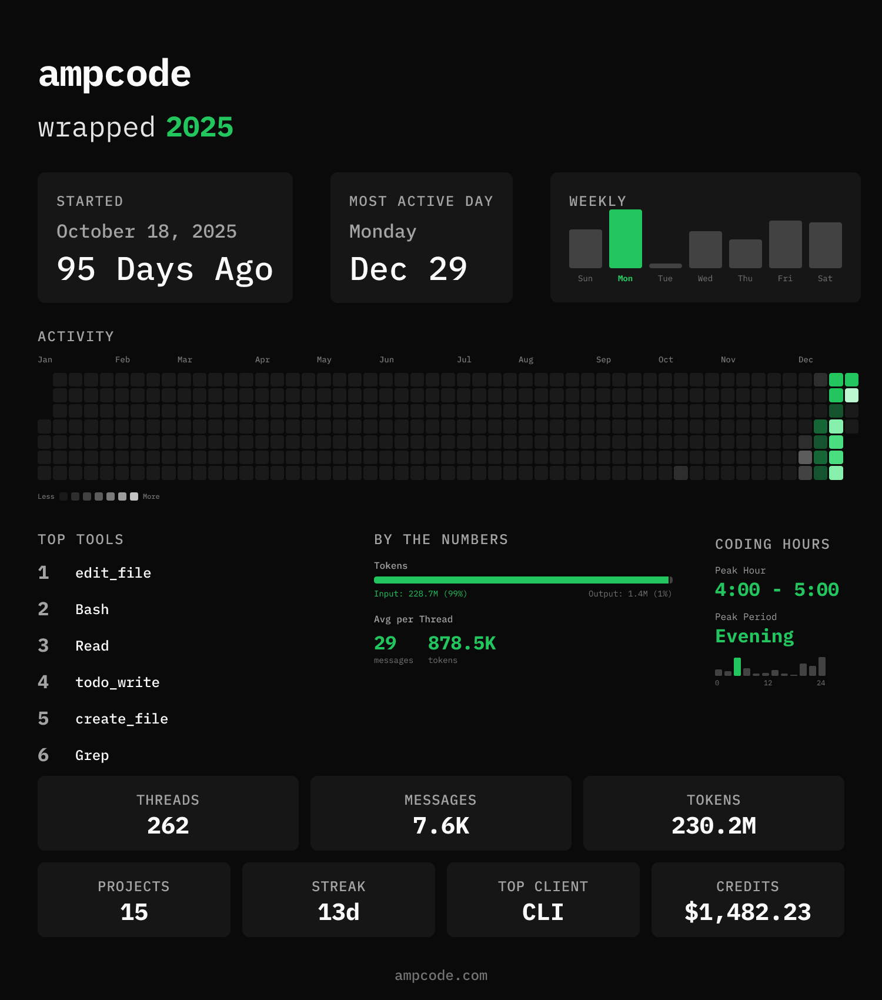

# ampcode-wrapped

Generate a personalized Spotify Wrapped-style summary of your [Amp](https://ampcode.com) usage.



## Features

- Scans your local Amp thread history
- Generates a beautiful stats card image
- Shows threads, messages, tokens, and credits used
- Activity heatmap visualization for the year
- Top tools used analysis
- Coding hours breakdown
- Streak tracking
- Auto-copy to clipboard
- Share directly to X/Twitter


### Run Locally

```bash
git clone https://github.com/rezhajulio/ampcode-wrapped.git
cd ampcode-wrapped
bun install
bun start
```

## CLI Options

```
ampcode-wrapped [OPTIONS]

OPTIONS:
  --year <YYYY>        Generate wrapped for a specific year (default: current year)
  --data-dir <DIR>     Override data directory (default: ~/.local/share/amp/threads)
  --output, -o <PATH>  Save image directly to specified path (skips save prompt)
  --format <FORMAT>    Image layout format (default: default)
                         default: 1500x1700 - standard layout
  --theme <THEME>      Color theme: dark or light (default: dark)
  --svg                Export as SVG instead of PNG
  --json               Output stats as JSON to stdout and exit (no image generation)
  --yes, -y            Skip confirmation prompts (auto-save, skip share prompt)
  --quiet, -q          Suppress rich prompts (no intro/outro/spinners)
  --no-clipboard       Skip copying image to clipboard
  --no-terminal-image  Skip displaying image in terminal
  --help, -h           Show help message
  --version, -v        Show version number

ENVIRONMENT:
  CI=true              Auto-disables clipboard and terminal image display
```

### Examples

```bash
ampcode-wrapped                       # Generate current year wrapped
ampcode-wrapped --year 2025           # Generate 2025 wrapped
ampcode-wrapped --theme light         # Use light theme
ampcode-wrapped -o ~/Desktop/amp.png  # Save directly to path
ampcode-wrapped --json                # Output raw stats as JSON
```

## Privacy

**All data stays on your machine.** ampcode-wrapped:

- Reads thread data only from your local `~/.local/share/amp/threads` directory
- Never transmits any data over the network
- Generates images locally using Satori and Resvg
- Does not collect analytics or telemetry

Your Amp usage data never leaves your computer.

## Requirements

- [Amp](https://ampcode.com) installed and used at least once

## License

MIT - see [LICENSE](./LICENSE)

## Author

[Rezha Julio](https://github.com/rezhajulio)

## Acknowledgments

- Inspired by https://github.com/moddi3/opencode-wrapped
